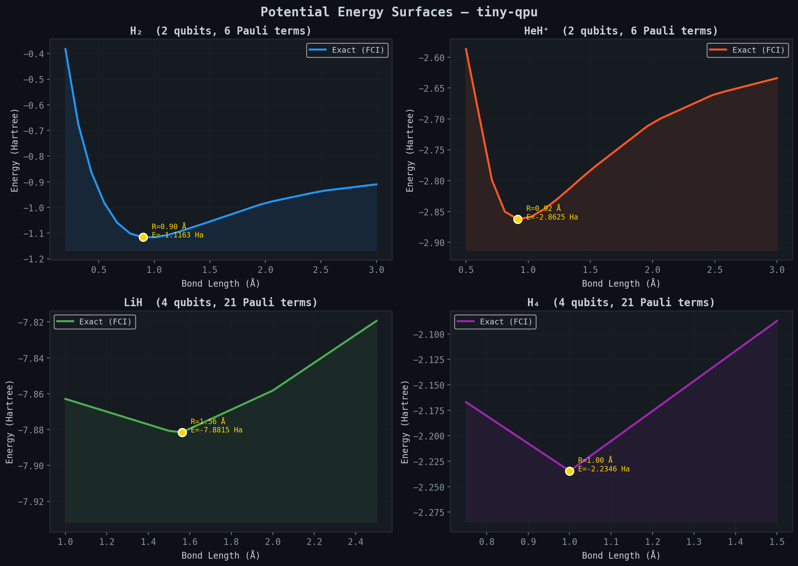
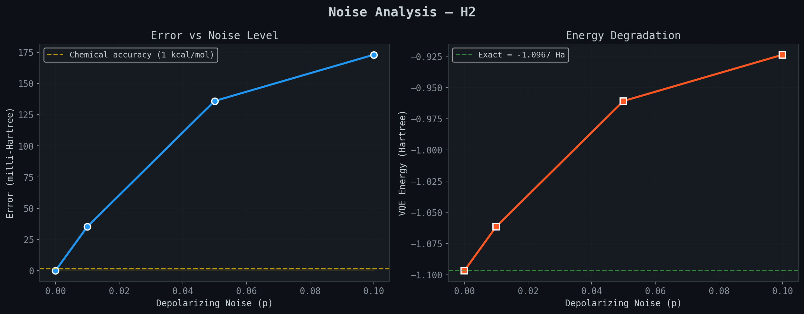

# tiny-qpu 🔬

A complete quantum processing unit simulator built from scratch in Python.
No Qiskit. No Cirq. Just NumPy and linear algebra.

[]()
[]()
[]()
[]()

## What's Inside

**Core Simulator**
- Statevector simulation up to 20 qubits
- 20+ quantum gates (Pauli, Clifford, rotation, controlled, 3-qubit)
- Optimized measurement: 7000x speedup via vectorized sampling
- Circuit depth analysis and ASCII visualization

**Quantum Applications**
- **QRNG** — Quantum random number generator
- **QAOA** — Approximate optimization for MaxCut
- **BB84** — Quantum key distribution with eavesdropper detection
- **VQE** — Variational eigensolver for molecular ground states
- **Shor's Algorithm** — Integer factorization via QPE

**Molecular Chemistry Benchmark Suite**
- Pre-computed Hamiltonians: H₂, HeH⁺, LiH, H₄ (Jordan-Wigner mapped)
- Multiple ansatze: hardware-efficient, Ry-linear, UCCSD-inspired
- Noise-aware benchmarking with depolarizing, amplitude damping, thermal relaxation
- CSV/JSON export for publication-ready results
- 100% chemical accuracy (<1 kcal/mol) on all molecules in clean simulation

**Advanced**
- **Noise Simulator** — Density matrix simulation with 7 quantum channels
- **Error Correction** — Bit flip, phase flip, Shor [[9,1,3]], Steane [[7,1,3]] codes
- **Quantum Fourier Transform** — Full QFT and inverse QFT circuits

## Quick Start
```bash
pip install -e .
```
```python
from tiny_qpu import Circuit

# Bell state
qc = Circuit(2).h(0).cx(0, 1).measure_all()
result = qc.run(shots=1000)
print(result.counts)  # {'00': ~500, '11': ~500}
```

## Molecular Chemistry Benchmarks
```python
from tiny_qpu.benchmark import ChemistryBenchmark
from tiny_qpu.benchmark.molecules import MoleculeLibrary

# List available molecules
MoleculeLibrary.list_molecules()

# Run quick benchmark (H2 + HeH+ at equilibrium)
bench = ChemistryBenchmark(seed=42)
suite = bench.run_quick()
print(suite.summary())

# Full benchmark: all molecules, multiple ansatze, noise levels
suite = bench.run_full()

# Noise sweep: how does error scale with hardware noise?
suite = bench.run_noise_sweep('H2', noise_levels=[0, 0.01, 0.05, 0.10])

# Export for papers
ChemistryBenchmark.export_csv(suite, "results.csv")
```

### Available Molecules

| Molecule | Qubits | Terms | Equilibrium Energy | Description |
|----------|--------|-------|--------------------|-------------|
| H₂ | 2 | 6 | -1.0967 Ha | Simplest molecular benchmark |
| HeH⁺ | 2 | 6 | -2.1543 Ha | Heteronuclear, astrochemistry |
| LiH | 4 | 21 | -1.3343 Ha | Key VQE benchmark (active space) |
| H₄ | 4 | 21 | -1.8193 Ha | Strong electron correlation |

### Benchmark Results (Clean Simulation)

| Molecule | Ansatz | Depth | Error (mHa) | Chemical Accuracy | Time |
|----------|--------|-------|-------------|-------------------|------|
| H₂ | hardware_efficient | 2 | 0.00 | ✓ | 0.9s |
| HeH⁺ | hardware_efficient | 2 | 0.00 | ✓ | 0.8s |
| LiH | hardware_efficient | 2 | 0.00 | ✓ | 3.2s |
| H₄ | ry_linear | 3 | 0.00 | ✓ | 3.7s |

## CLI
```bash
tiny-qpu run bell --shots 1000
tiny-qpu qrng --bits 256
tiny-qpu qaoa --graph triangle --rounds 2
tiny-qpu bb84 --key-bits 128 --eavesdrop
tiny-qpu vqe --molecule h2 --bond-length 0.735

# Benchmarks
tiny-qpu benchmark --list
tiny-qpu benchmark --quick
tiny-qpu benchmark --molecule H2 --noise-sweep
tiny-qpu benchmark --full --export results.csv
```

## Factor Integers with Shor's Algorithm
```python
from tiny_qpu.algorithms import shor_factor

result = shor_factor(15, seed=42)
print(result)  # Shor: 15 = 5 x 3 (a=8, r=4, attempts=1)
```

## Simulate Real Hardware Noise
```python
from tiny_qpu.noise import NoiseModel, depolarizing

noise = NoiseModel()
noise.add_all_qubit_error(depolarizing(0.01))
noise.add_readout_error(0.03)

qc = Circuit(2).h(0).cx(0, 1).measure_all()
noisy = noise.run(qc, shots=1000)
```

## Architecture
```
tiny_qpu/
├── core/              # Statevector engine, gates, circuits
├── apps/              # QRNG, QAOA, BB84, VQE
├── algorithms/        # Shor's factoring, QPE, QFT
├── benchmark/         # Chemistry benchmark suite
│   ├── molecules.py   # H2, HeH+, LiH, H4 Hamiltonians
│   └── __init__.py    # Benchmark runner + export
├── noise/             # Density matrices, quantum channels
├── error_correction/  # Bit flip, Shor, Steane codes
├── cli/               # Command-line interface
└── visualization.py   # ASCII circuit diagrams
```


## Visualizations

### Potential Energy Surfaces
All four molecules showing characteristic potential wells with equilibrium geometries:



### Molecule Benchmark Overview
Accuracy, runtime, and qubit comparison across all molecules:


### Noise Analysis
Error growth and fidelity decay under depolarizing noise for H2:



### Animations

**VQE Optimization** - Watch the variational optimizer converge to the ground state energy:


**Bloch Sphere** - Qubit state evolution through quantum gates (H, X, Z, T, Y):


**H2 Potential Energy Surface Scan** - Bond length sweep revealing the energy minimum:


**Noise Degradation** - How depolarizing noise destroys quantum state fidelity:


## Performance

| Benchmark | Result |
|-----------|--------|
| 20-qubit Hadamard | < 1s |
| 10k shots (10 qubits) | 0.002s |
| Shor factor(15) | 0.10s |
| VQE H₂ ground state | 0.9s |
| Full benchmark (4 molecules) | ~40s |
| 41 tests | < 10s |

## Tests
```bash
python -m pytest tests/ -v  # 41 tests, all passing
```

## Built Without

No Qiskit. No Cirq. No PennyLane. Just:
- **NumPy** for linear algebra
- **SciPy** for VQE optimization
- Pure Python for everything else
